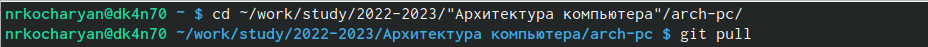

---
## Front matter
title: "Отчёт по лабораторной работе №3"
subtitle: "Архитектура вычислительных систем"
author: "Кочарян Никита Робертович"

## Generic otions
lang: ru-RU
toc-title: "Содержание"

## Bibliography
bibliography: bib/cite.bib
csl: pandoc/csl/gost-r-7-0-5-2008-numeric.csl

## Pdf output format
toc: true # Table of contents
toc-depth: 2
lof: true # List of figures
lot: true # List of tables
fontsize: 12pt
linestretch: 1.5
papersize: a4
documentclass: scrreprt
## I18n polyglossia
polyglossia-lang:
  name: russian
  options:
	- spelling=modern
	- babelshorthands=true
polyglossia-otherlangs:
  name: english
## I18n babel
babel-lang: russian
babel-otherlangs: english
## Fonts
mainfont: PT Serif
romanfont: PT Serif
sansfont: PT Sans
monofont: PT Mono
mainfontoptions: Ligatures=TeX
romanfontoptions: Ligatures=TeX
sansfontoptions: Ligatures=TeX,Scale=MatchLowercase
monofontoptions: Scale=MatchLowercase,Scale=0.9
## Biblatex
biblatex: true
biblio-style: "gost-numeric"
biblatexoptions:
  - parentracker=true
  - backend=biber
  - hyperref=auto
  - language=auto
  - autolang=other*
  - citestyle=gost-numeric
## Pandoc-crossref LaTeX customization
figureTitle: "Рис."
tableTitle: "Таблица"
listingTitle: "Листинг"
lofTitle: "Список иллюстраций"
lotTitle: "Список таблиц"
lolTitle: "Листинги"
## Misc options
indent: true
header-includes:
  - \usepackage{indentfirst}
  - \usepackage{float} # keep figures where there are in the text
  - \floatplacement{figure}{H} # keep figures where there are in the text
---

# Цель работы

Освоение процедуры оформления отчетов с помощью легковесного языка разметки Markdown.

# Задание

1.	В соответствующем каталоге сделайте отчёт по лабораторной работе No 3
в формате Markdown. В качестве отчёта необходимо предоставить отчёты
в 3 форматах: pdf, docx и md.
2.	Загрузите файлы на github.

# Теоретическое введение

# Выполнение лабораторной работы

1.	Открываем терминал, переходим в каталог курса сформированного при выполнении лабораторной работы №3, обновляем локальный репозиторий, скачав изменения из удаленного репозитория. (рис. [-@fig:001])

{ #fig:001 width=90% }

2.	Переходим в каталог с шаблоном отчета по лабораторной работе №4, проводим компиляцию шаблона (рис. [-@fig:002]

{ #fig:002 width=90% }

3.	Удаляем полученный файл (рис. [-@fig:003])

{ #fig:003 width=90% }

4.	Открываем файл report.md с помощью текстового редактора gedit. (рис. [-@fig:004])

{ #fig:004 width=90% }

5.	Загрузим файлы на github. (рис. [-@fig:005])

{ #fig:005 width=90% }

# Выводы

Мы научились работать с Makefile и смогли сделать отчет с помощью Markdown.

# Список литературы{.unnumbered}

::: {#refs}
:::
