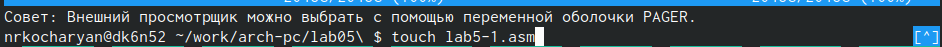

---
## Front matter
title: "Лабораторная работа №5"
subtitle: "Архитектура вычислительных систем"
author: "Кочарян Никита Робертович"

## Generic otions
lang: ru-RU
toc-title: "Содержание"

## Bibliography
bibliography: bib/cite.bib
csl: pandoc/csl/gost-r-7-0-5-2008-numeric.csl

## Pdf output format
toc: true # Table of contents
toc-depth: 2
lof: true # List of figures
lot: true # List of tables
fontsize: 12pt
linestretch: 1.5
papersize: a4
documentclass: scrreprt
## I18n polyglossia
polyglossia-lang:
  name: russian
  options:
	- spelling=modern
	- babelshorthands=true
polyglossia-otherlangs:
  name: english
## I18n babel
babel-lang: russian
babel-otherlangs: english
## Fonts
mainfont: PT Serif
romanfont: PT Serif
sansfont: PT Sans
monofont: PT Mono
mainfontoptions: Ligatures=TeX
romanfontoptions: Ligatures=TeX
sansfontoptions: Ligatures=TeX,Scale=MatchLowercase
monofontoptions: Scale=MatchLowercase,Scale=0.9
## Biblatex
biblatex: true
biblio-style: "gost-numeric"
biblatexoptions:
  - parentracker=true
  - backend=biber
  - hyperref=auto
  - language=auto
  - autolang=other*
  - citestyle=gost-numeric
## Pandoc-crossref LaTeX customization
figureTitle: "Рис."
tableTitle: "Таблица"
listingTitle: "Листинг"
lofTitle: "Список иллюстраций"
lotTitle: "Список таблиц"
lolTitle: "Листинги"
## Misc options
indent: true
header-includes:
  - \usepackage{indentfirst}
  - \usepackage{float} # keep figures where there are in the text
  - \floatplacement{figure}{H} # keep figures where there are in the text
---

# Цель работы

Приобретение практических навыков работы в Midnight Commander. Освоение инструкций языка ассемблера mov и int.

# Задание

1.	Создайте копию файла lab5-1.asm. Внесите изменения в программу (без использования внешнего файла in_out.asm), так чтобы она работала по следующему алгоритму:
• вывести приглашение типа “Введите строку:”;
• ввести строку с клавиатуры;
• вывести введённую строку на экран.

2.	Получите исполняемый файл и проверьте его работу. На приглашение ввести строку введите свою фамилию.

3.	Создайте копию файла lab5-2.asm. Исправьте текст программы с использование подпрограмм из внешнего файла in_out.asm, так чтобы она работала по следующему алгоритму:
• вывести приглашение типа “Введите строку:”;
• ввести строку с клавиатуры;
• вывести введённую строку на экран

4.	Создайте исполняемый файл и проверьте его работу.

# Выполнение лабораторной работы

1.	Открываем Midnight Commander, Пользуясь клавишами ↑ , ↓ и Enter переходим в каталог ~/work/arch-pc созданный при выполнении лабораторной работы №4, с помощью функциональной клавиши F7 создаем папку lab05

{ #fig:001 width=90% }

2.	Пользуйясь строкой ввода и командой touch файл lab5-1.asm

{ #fig:002 width=90% }

3.	С помощью команды функциональной клавиши F4 открываем файл lab5-1.asm , вводим текст из листинга 6.1

{ #fig:003 width=90% }

4.	Проверяем файл lab5-1.asm

{ #fig:004 width=90% }

5.	Оттранслируем текст программы lab5-1.asm в объектный файл. Выполняем компоновку объектного файла и запускаем получившийся исполняемый файл. Программа выводит строку 'Введите строку:' и ожидает ввода с клавиатуры. На запрос вводим ФИО.

{ #fig:005 width=90% }

6.	Скачиваем файл in_out.asm с ТУИС, с помощью F5 перенесем его в каталог, где дежит файл с программой.

{ #fig:006 width=90% }

7.	С помозью клавиши F6 создаем копию файла lab5-1.asm с именем lab5-2.asm

{ #fig:007 width=90% }

8.	Вносим изменения в файл lab5-2.asm

{ #fig:008 width=90% }

9.	Проверим работу файла

{ #fig:009 width=90% }

# Самотоятельная работа

1.	Редактируем файл lab5-2.asm так, чтобы при вводе текста, он отображал его повторно.

{ #fig:010 width=90% }

2.	Проверяем работоспобность файла

{ #fig:011 width=90% }

# Выводы
 
	В ходе лабораторной работы, я приобрел практические навыки работы с Midnight Commander. Так же мною были основены инструкции языка ассемблера mov и int.
 
# Список литературы{.unnumbered}

::: {#refs}
:::
