---
## Front matter
title: "Лабораторная работа №6"
subtitle: "Архитектура вычислительных систем"
author: "Кочарян Никита Робертович"

## Generic otions
lang: ru-RU
toc-title: "Содержание"

## Bibliography
bibliography: bib/cite.bib
csl: pandoc/csl/gost-r-7-0-5-2008-numeric.csl

## Pdf output format
toc: true # Table of contents
toc-depth: 2
lof: true # List of figures
lot: true # List of tables
fontsize: 12pt
linestretch: 1.5
papersize: a4
documentclass: scrreprt
## I18n polyglossia
polyglossia-lang:
  name: russian
  options:
	- spelling=modern
	- babelshorthands=true
polyglossia-otherlangs:
  name: english
## I18n babel
babel-lang: russian
babel-otherlangs: english
## Fonts
mainfont: PT Serif
romanfont: PT Serif
sansfont: PT Sans
monofont: PT Mono
mainfontoptions: Ligatures=TeX
romanfontoptions: Ligatures=TeX
sansfontoptions: Ligatures=TeX,Scale=MatchLowercase
monofontoptions: Scale=MatchLowercase,Scale=0.9
## Biblatex
biblatex: true
biblio-style: "gost-numeric"
biblatexoptions:
  - parentracker=true
  - backend=biber
  - hyperref=auto
  - language=auto
  - autolang=other*
  - citestyle=gost-numeric
## Pandoc-crossref LaTeX customization
figureTitle: "Рис."
tableTitle: "Таблица"
listingTitle: "Листинг"
lofTitle: "Список иллюстраций"
lotTitle: "Список таблиц"
lolTitle: "Листинги"
## Misc options
indent: true
header-includes:
  - \usepackage{indentfirst}
  - \usepackage{float} # keep figures where there are in the text
  - \floatplacement{figure}{H} # keep figures where there are in the text
---

# Цель работы

Освоение арифметических инструкций языка ассемблера NASM.

# Задание

1.	Написать программу вычисления выражения 𝑦 = 𝑓(𝑥). Программа должна выводить выражение для вычисления, выводить запрос на ввод значения 𝑥, вычислять заданное выражение в зависимости от введенного 𝑥, выводить результат вычислений.Вид функции 𝑓(𝑥) выбрать из таблицы 6.3 вариантов заданий в соответствии с номером полученным при выполнении лабораторной работы. 

2.	Создайте исполняемый файл и проверьте его работу для значений 𝑥1 и 𝑥2 из 6.3

# Выполнение лабораторной работы

1.	Создаем каталог для программ лабораторной работы, переходим в него и создаем файл

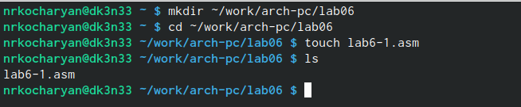{ #fig:001 width=90% }

2.	Редактируем файл lab6-1.asm с помощью листинга 7.1

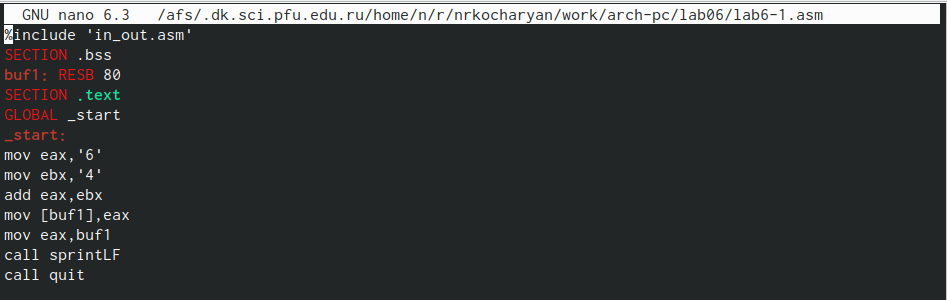{ #fig:002 width=90% }

3.	Создаем исполняемый файл и запускаем его.

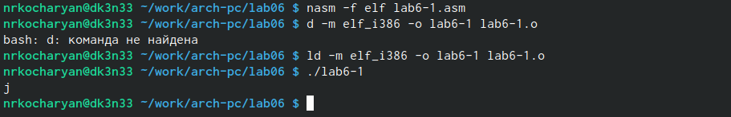{ #fig:003 width=90% }

4.	Изменяем текст программы lab6-1.asm, создаем исполняемый файл и запускаем его.

{ #fig:004 width=90% }

5.	Создаем файл lab6-2.asm и вводим в него текст программы из листинга 7.2 , создаем исполняемый файл и запускаем его.

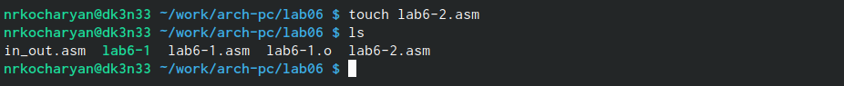{ #fig:005 width=90% }

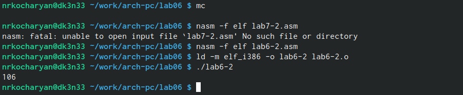{ #fig:006 width=90% }

6.	Изменяем строки mov eax,'6' и mov ebx,'4' на строки mov eax,6 mov ebx,4

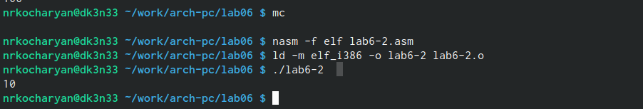{ #fig:007 width=90% }

7.	Заменяем функцию iprintLf на iprint

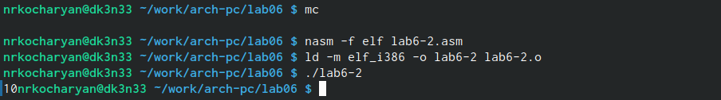{ #fig:008 width=90% }

8.	Создаем файл lab6-3.asm в каталоге ~/work/arch-pc/lab06

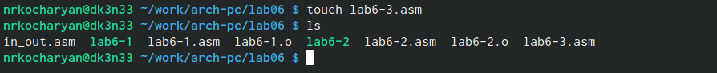{ #fig:009 width=90% }

9.	Редактируем файл lab6-3.asm с помощью листинга, создаем исполняемый файл и запускаем его

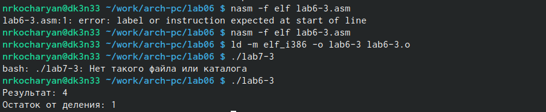{ #fig:010 width=90% }

10.	Изменяем текст программы для вычисления f(x) = (4*6+2)/5, создаем исполняемый файл и проверяем его работу.

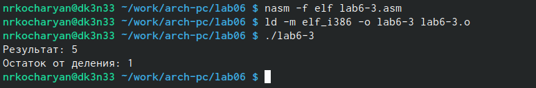{ #fig:011 width=90% }

11.	Создаем файл variant.asm в каталоге ~/work/arch-pc/lab06

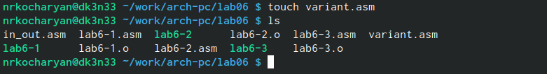{ #fig:012 width=90% }

12.	Редактируем файл variant.asm с помощью листинга 7.4, создаем исполняемый файл и запускаем его.

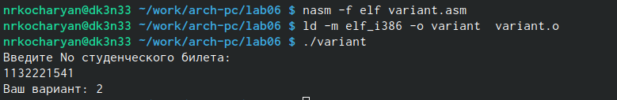{ #fig:013 width=90% }

#Ответы на вопросы

1.	mov eax, rem all sprint

2.	mov ecx,x - запись входной переменной в регист ecx
	mov edx, 80 - запись размера переменной в регистр edx
	call spread - вызов процедуры чтения данных

3.	Функция преобразующая, ascii-код символа в целое число и записывающая результат в регистр eax

4.	xor edx,edx mov ebx, 20 div ebx inc edx

5.	ebx

6.	Инструкция inc используется для увеличения операнда на единицу

7.	mov eax,rem call sprint mov eax,edx call iprintLF

#Самостоятльная работа

1.	Вносим измненения в файл variant.asm чтобы он вычислил x1 и x2 в функции (12x + 3)5

{ #fig:014 width=90% }

2.	Проверяем работу файла

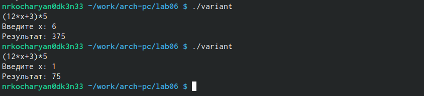{ #fig:015 width=90% }

# Выводы

Я освоил арифметические инструкции языка ассемблера NASM.

# Список литературы{.unnumbered}

::: {#refs}
:::
